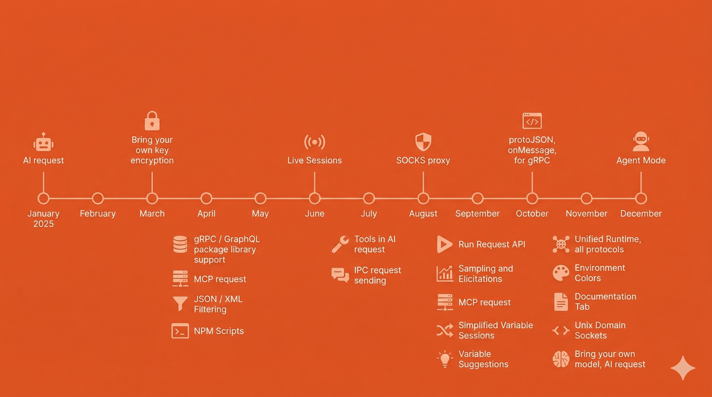

In [my 2024 "Year in Review"](./2024-in-review/), I noted that 2025 would be about **survival** with the arrival of a baby girl. Well, did I **survive**?

Yes. I'm most proud of becoming a more confident, in-rhythm parent. The kind who doesn't second-guess every decision or stay up at night wondering if I'm doing enough. Emilia arrived in February, and while going from one to two kids has been incrementally harder (not exponentially, knock on wood), it's taught me that confidence and presence matter more than perfection. At work, I continued to lead by doing, diving deep into AI protocols and MCP while shipping features that meaningfully improved the lives of millions of developers. But as always, the job's not finished.

2025 was also a year of establishing better habits: I read 26 books, cut my screen time to just over 2 hours daily, and found myself more present as a result. As I look toward 2026, I want to double down on what's working: fewer distractions, higher quality experiences, and embracing the kind of boredom that makes space for real thinking and creativity.

---

## What I accomplished

- **Welcomed the arrival of Emilia**, my beautiful baby girl born February 2025.
- **Became a scout and angel investor** and wrote one check: [mastra](https://mastra.ai).
- **Spoke at the inaugural MCP Night** ([link to YouTube](https://www.youtube.com/watch?v=qvpi6XtVbFI&list=PLB4m9iWZsJzj02wRZl-MDsDvOqtP2ujgt&index=26)) and did a true, fully live demo. As they say, the vibes were great, and it's a memory I'll look back upon fondly for years to come.
- **Spoke at [TSConf](https://tsconf.ai/)** and attempted to re-position Postman as so much more than just an HTTP client (although it's the very best one at that).
- **Traveled to Omaha** to visit my friends from Union Pacific (my first job!) before the birth of Emilia.
- **[Read 26 books](https://www.goodreads.com/readingchallenges/gr/annual/2025)** and listened to 36688 minutes of music.
- **Led the Postman API client team** with some major launches: **NPM Scripts**, **[simplified variables](https://blog.postman.com/engineering/a-simpler-and-local-first-variables-experience/)**, **reusable requests**, and **MCP and AI protocols**, and [so much more](https://www.postman.com/release-notes/postman-app/).
- **Participated in a panel discussion** on developer experience (DX) in the era of artificial intelligence (AI). It was my first ever panel, and I quite enjoyed it!
- **Survived one year** of a Trump presidency. Only three more to go 😬

## What I learned

- **Having two children is _incrementally_, not exponentially harder.** (_knock on wood_) In year one with Emilia (and year three with Noah), it has gotten mildly harder, not exponentially. It helps a lot that Emilia is the easiest, happiest baby, but like I note below, I also think both Maggie and I have become more confident, in rhythm parents.
- **Deepened my understanding of AI** particularly manifested by helping the team that built the AI protocol (comparing all different LLM models, which caused us to go deep on models themselves) as well as the best MCP client
- **Engineering management is changing**. Similarly to Wil Larson's observations in ["Good Engineering Management is a fad"](https://lethain.com/good-eng-mgmt-is-a-fad/) I do think I learned a good, hard lesson this year that engineering managers aren't _always_ needed and particularly in the age of AI the profession is changing and will keep changing meaningfully.
- **Cultivating product-minded engineers is _generally_ more valuable than traditional product managers**. Keeping the team close to direct user discussions, problems, and communications means that the best ideas come from engineers, by engineers, for engineers. The way it ought to be.

## What I’m proud of

- **Being an active parent** particularly for Noah (almost three years old). I think it helps that as a dad, as my kids get older, I get to shine more by playing with them, teaching them things, etc.
- **Being a confident parent**. Having two children has made me a much more confident parent. I remember with Noah I had a lot of feelings of doubt, anxiety, etc. as to whether I was doing enough, whether I was helping enough, etc. and now with two most of those feelings have gone away and I am getting more into rhythm in being a parent.
- **Continuing to learn**. As a parent, it's important to me that I maintain my curiosities and tap into my learn by doing mindset. This year, I continued to tinker on my book "Riley the Robot" (a great training ground for gauging the pace of AI models, particularly image models) and more generally dove deep into the space of AI with models, MCP, and so much more. This will continue to be important to not let my skills grow stagnant.
- **Internalized habits**. Establishing a **reading routine** (26 books!) that felt like a conscious habit rather than a chore. Specifically, just setting the goal (24 / year) orients my behavior as well as placing my phone away from my bedstand at night so that I _have_ to read.
- **Not being a zombie**. I think there's a real risk in society of not unplugging, and it's been fascinating going to events and just seeing people on their phone for significant chunks of them. I've been able to cut my **screen time** down to just over 2 hours daily, down from 3-4 hours in recent years. I still want to drive this down further, or in other words job's not finished.

## What I most enjoyed

I think you can learn a lot about a person by what they like, and I think the world could use more positivity. Thus, these are a few of my favorite things (see also my [all-time favorites](/favorites/))

  
Albums

  1. **SAYA** by Saya Gray
  2. **Let God Sort 'Em Out** by Clipse
  3. **SABLE, fABLE** by Bon Iver
  4. **GNX** by Kendrick Lamar
  5. **Chromokopia** by Tyler, the Creator

  Lots of great albums this year. As usual, a kind of mix of hip-hop/rap and some more experimental stuff. The big standout this year _by far_ was Saya Gray, who I think is truly amazing and I wish I had discovered sooner.

  
Songs

1. **[...THUS IS WHY (I DON'T SPRING FOR LOVE)](https://open.spotify.com/track/29UD619bhwDjNXvuSh6cDz?si=73af7b490b394a69)** by Saya Gray
2. **[AA BOUQUET FOR YOUR 180 FACE](https://open.spotify.com/track/2T9XG0dOWvJw23EUC8YIn5?si=5aeb157b06214ca9)** by Saya Gray
3. **[P.O.V.](https://open.spotify.com/track/0mwlZQjUxspUTpAzLwexw7?si=f5543f5203e24c62)** by Clipse
4. **[By the Grace of God](https://open.spotify.com/track/5XhsQnSiO6JPuiG4RPTugh?si=dddbecd530014803)** by Clipse
5. **[Pirate Radio](https://open.spotify.com/track/6HQFxxX9d7HailblPX0Nxy?si=4d6c8fc6b1b04f64)** by Genesis Owusu

No surprise, more Saya Gray and some standouts from the earlier albums. By the Grace of God is just an amazing song. Funnily enough, I have gotten my son Noah (almost three years old now!) to call the first two songs "bangers." I agree, Noah!

  
Books

1. **[City of Thieves](https://www.goodreads.com/book/show/1971304.City_of_Thieves)** by David Benioff
2. **[One Day, Everyone Will Have Always Been Against This](https://www.goodreads.com/book/show/213870084-one-day-everyone-will-have-always-been-against-this)** by Omar El Akkad
3. **[Atmosphere](https://www.goodreads.com/book/show/220817728-atmosphere)** by Taylor Jenkins Reid
4. **[Barbarians at the Gate](https://www.goodreads.com/book/show/781182.Barbarians_at_the_Gate)** by Bryan Burrough and John Helyar
5. **[Careless People](https://www.goodreads.com/book/show/223436601-careless-people)** by Sarah Wynn-Williams

Lots of standouts this year. "City of Thieves" was such a surprising book that I couldn't put down, as was "Careless People" (thanks Parth Verma for the recommendation). Additionally, Atmosphere was such a great love story, Barbarians at the Gate was a fascinating deep dive on a leveraged buy out and business practices, and last, but not least, "One Day, Everyone Will Always Have Been Against This" was a good, but hard, read on western imperialism using the Israel and Palestine conflict as a recent example. Unfortunately, I think this lens might be highly useful in 2026 and beyond. Highly recommend any and all of these books.

  
Things

- **[S.E.H Kelly chore coat](https://sehkelly.com/en-us/products/acorn-work-jacket?variant=53301457715530)**. I have an older, cheaper one in cotton moleskin instead of wool. It's the best jacket I own and I wear it nearly every day! One of my favorite things is discovering smaller brands that really nail an aesthetic and style that I really love, and S.E.H Kelly is one of my favorite brands ever.
- **[The Iron Snail "The Dinghy Skipper" wallet](https://theironsnail.us/products/the-dinghy-skipper-_01)**. This is a great little wallet and it's been cool to see the Iron Snail brand grow in popularity and made in USA high-quality goods.
- **[Fairbault Woolen Mill wool blanket (twin)](https://www.faribaultmill.com/products/cabin-wool-throw-charcoal)**. A great, wool blanket that I use nightly on the couch.
- **[Anker "Laptop" Power Bank](https://www.amazon.com/dp/B0DCBB2YTR)**. I use this thing all the time, mostly for charging iPhones but yes, occasionally my MacBook when traveling.
- **[Ratcheting Screwdriver by LTT](https://www.lttstore.com/products/screwdriver)**. An amazing screwdriver that I use around the house, regularly.

## What I’m Going to Focus on in 2026

1. **Less and higher quality**. In purchases, social engagements, and content, I will actively seek out higher quality versions of these things, actively consume less content, and spend true quality time with friends, family, and colleagues.
1. **Balance and satisfaction**. It's hard for me to "turn it off" when I'm not at work -- although I have made some progress -- and while that makes me strive for better, it does sometimes take a toll on my presence, quality-of-life, etc. I aim to strike an even better balance in 2026, while not regressing in my job performance but continuing to show up at work and for my family.
1. **Be bored.** I think in modern society we're inundated with content and noise that makes it hard to get signal. In 2026, I want to spend less time on my phone, more time thinking, reading, and maybe just doing nothing. (See this [Harvard Business Review video](https://hbr.org/2025/08/you-need-to-be-bored-heres-why) for an example of why this is beneficial)
1. **Date, with children.** We've dabbled with date nights and other types of recurring habits in 2025, but didn't quite nail it. In 2026, we'll need to try some new techniques like a standing date night activity, even if it's not fully going out and getting a babysitter.
1. **Travel, with (and without) children.** In 2025, we did some travel, but mostly intra California. In 2026, I want to travel at least one international trip (Portugal? Mexico? to be determined) and one trip with just my wife Maggie and me.

I'll keep some of my standing goals (which are really just habits at this point) of 24 books a year, which is a nice pace for one book every two weeks. No point tracking a goal if it doesn't change behavior 🤓

See you in 2027!
