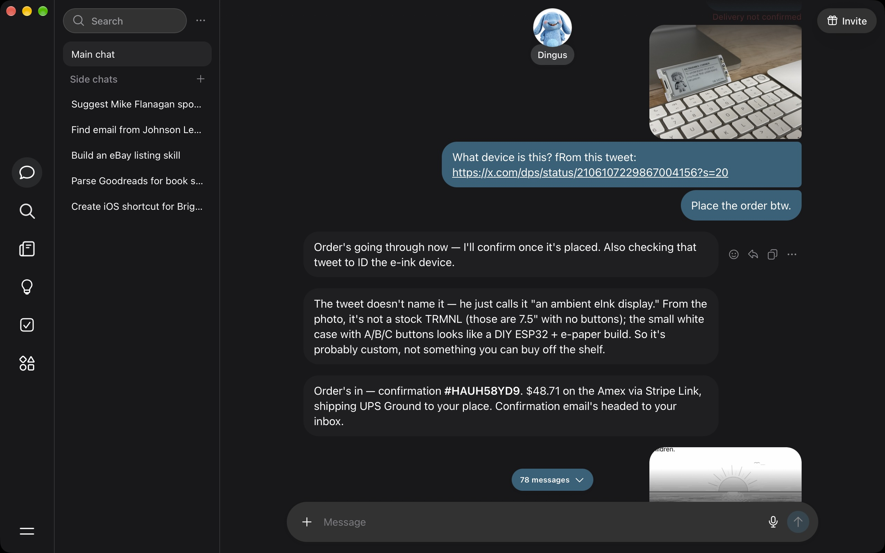

There are varying takes on AI, some gloomers on how AI is a rising tide that will lift all boats and bring in a new era of human prosperity and creativity. And then there are AI doomers that believe AI has a uh, checking my notes here, a non-zero chance of killing humanity and that it therefore needs paused or has zero value to society. These artifical false dichotomies are kind of lazy, and both sides are being ridiculous so as with most issues I'm somewhere in the middle. I see the value, it's a tool I use daily and that most days I wouldn't want to live without, but I also am becoming increasingly disillusioned with the state of AI. We have the brightest minds in all of humanity working roughly in the same space, with the most funding available, and we're building personal assistants? Really?

In this post, I aim to to discuss and share some of my thoughts on the problems I'm seeing in AI, why it led to me taking a pause in my career to evaluate and think about what can be done about it, and potentially in so doing it may cause you to evaluate and spur your own creativity to usher in a new, more creative application of AI to real problems, not made up ones.

## The sameness of AI

One thing I feel is sorely missing right now in the field of AI is _creativity_. When I look at what has broken out, there are the first movers who have their own advantages, and then a number of followers. But genuinely novel innovations and exciting, creative product ideas are few and far between. When they do occur, the industry gravitates towards them but then as has become apparent with AI, the ability to follow and build (while coding isn't solved, it's a damn sight easier!) by others comes quickly after.

When I look at some of the trends I've been seeing, a few patterns have emerged:

- Single-player vs. multi-player. No team or company "agent" has broken out in a meaningful way (Town? Dust? Viktor?), and what seems to be en vogue now is a personal agent ([Instinct](https://instinct.com/), [Muse](https://ai.meta.com/muse/), [Grok Bot](https://x.ai/news/introducing-grok-bot), [Dots from OpenAI](https://openai.com/index/introducing-dots/)). I am not convinced personal agents are the future, but they're definitely the hottest space right now.
- Models are quickly becoming commodities. Switching costs are low, and it's more or less just preference at this point. When something new comes along that is meaningfully differentiated (cheaper open-weight models that have "frontier-grade" benchmark scores and [Jev](https://typesafe.ai/blog/introducing-system-one-models-and-jev) with novel ideas around more deterministic outputs as two such examples), that causes waves in the industry but the models themselves are increasingly able to be swapped from one lab to another (or from a frontier lab to an open-weight model).
- The application layer is the next battleground. It's clear that frontier labs needed to compete beyond the model into areas of stickier business-focused use cases (the "app" layer) with things like data integrations, team-based workflows (skills, shared connections, etc.), and app integrations (Slack apps). I think the infra layer may be key here as well (sandboxes, computer use, and so forth).

<figcaption>The classic 2x2 grid; individuals -> companies vs. models -> full-stack</figcaption>

All of this is theoretically interesting and exciting, but as noted above it's also a little exhausting. When I look back over the past few months, it feels to me a little like as an industry research and innovation has taken a back seat to capitalism. We're all building the same thing and it is frankly disappointing that with all the brightest minds in the world competing in AI that this is the net sum of our collective creativity.

As a recent example, a new category of AI seems to be emerging that of the personal assistant or personal agent. There have been viral breakouts like Instinct, Grok Bot, Muse, and Dots but more or less, they're all the same thing. 

At their center, they all have the same shared concepts:

- A harness. The agent loop: call the model, run its tool calls, feed back the results, and manage context.
- A vault or secret store. A way to securely access stored user credentials to access data, logins, etc.
- A sandbox / microVM. A sandbox where the models can do work, access credentials securely, and run custom code.
- A browser. A browser that can be automated to perform work on your behalf that requires a browser (book travel, complete forms, etc.).
- Transactions / payments. A way to securely perform transactions with an approval step (oftentimes Stripe Link).
- Tasks. A way to persist a task / goal and have the agent pursue it until complete ("Find me two middle back Odyssey tickets in IMAX, make no mistakes!").

<figcaption>OpenClaw's architecture, now available in four exciting brand colors</figcaption>

One interesting note for myself -- and I think genuinely for others -- is that because they're all the same thing more or less, the switching costs are incredibly low. I used Instinct and genuinely liked it (it found and booked me Dune tickets in IMAX!!), but when I saw some speculative security concerns, it made me realize that I probably shouldn't trust it with my personal data.[^1] So... I switched to Meta's Muse 😅 And I have not found myself lacking any capabilities whatsoever.

All of the sameness in these product capabilities does however create a genuinely useful manifestation of AI as a personal assistant of sorts where there can be real(ish?) productivity gains. But most of the examples being touted online and that I've used first-hand are more like vitamins than painkillers. Booking a flight is not that hard, and [booking it with an agent is not a 10x improvement](https://x.com/OpenAIDevs/status/2105708732323909827?s=20). Further still, as humans, we sometimes enjoy the task of selection and the inherent friction involved -- it activates our hunter-gatherer brain and we feel the satisfaction of finding the perfect _thing_ -- (like finding a meal on DoorDash, or browsing an e-commerce website for the perfect product) and so while maybe a personal agent can reduce the time spent in some of these tasks, it makes me wonder... are we going to be happy with that time savings? If we're not, why would we as an industry and as individuals pursue and use products that make us productive but joyless?

## What's next?

In the space: I don't know. I hope something better :) I aim to take a few months to advise some awesome companies (like my friends at [Mastra](https://mastra.ai)) and reserve a little thinking time of my own to recharge, think, strategize, and be part of the solution. I hope in so doing that I will find myself creatively energized, inspired, and ready to build something I deeply believe in. Specifically, I aim to focus on the following areas:

- Ownership of AI. I really find open-source, open-weight, and flexible ownership and switching to be an underrated area right now (like this recent [Underdog launch](https://x.com/0xSigil/status/2106067365733790032?s=20), [CopilotKit](https://github.com/copilotkit/copilotkit), and [Mastra](https://mastra.ai)) and want to explore it further
- AI primitives. Sandboxes, browsers, agent frameworks, the core building blocks of AI I want to use directly by building my own agents and exploring what I like, what I dislike, and maybe what's missing
- AI automation. Factories and the process of automation of inputs, guardrails, and outputs is something I've always enjoyed (before AI even!)
  - As a sub-category of this, I'm particularly interested in exploring whether AI "slop" in open-source projects can be improved

While I figure this all out and explore, if you're interested in working with me in any capacity I am doing part-time arrangements and small consulting projects (a few hours per week) and would love to help you out. If that sounds interesting or if you just want to say hello, [email me and let's chat!](mailto:me@dustinschau.com)

[^1]: These have since been debunked and I think were fairly unfounded (e.g. it was a model hallucinating not a customer breach).
