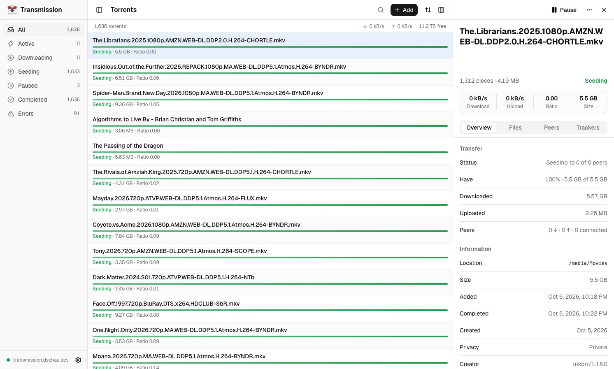
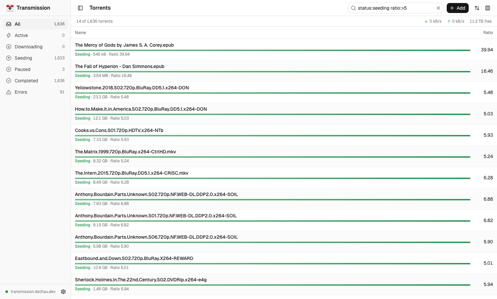
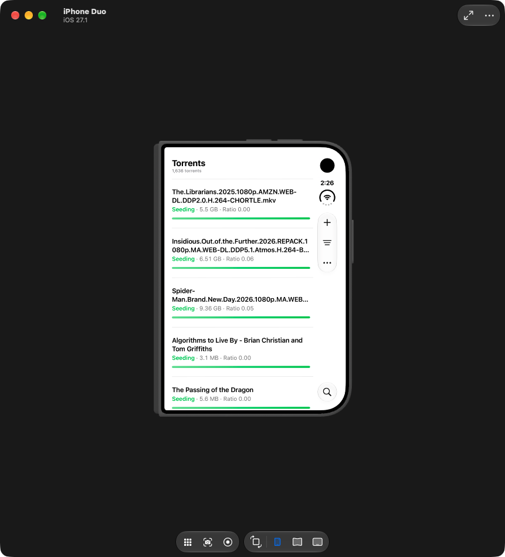

One of the things that originally drew me to software engineering was solving problems and building things in service of those problems.
One problem I have been facing is that I am on a pretty ancient Intel NUC that runs my home theater PC setup, and that means that I'm also on a very outdated version of the Transmission client (v3.0.0).

But, wielding AI (and tokens), I think we've entered into a new age of software, not where it's dead, but where it can be built by those closest to the problem and customized to their exact specifications.

So thus, announcing _my_ (and maybe your?) Transmission web client.

## Capablities

In my limited testing, it largely is a drop-in replacement of the previous UI I was using, and supports:

- Viewing torrent status and real-time updates (polls every 2s)
- Adding, deleting, performing operation per torrent
- Bulk operations (select all and pause, delete, etc.)

I have genuinely not even tried it with new versions of the Transmission client, so please: try it yourself, and if you run into anything, open an issue with a clear reproduction and I'll ask an agent to look into it 🤖

Additionally, I added a few features that I find useful:

- Filtering! You can use queries like `status:seeding ratio:<0.25` to identify segments of torrents and take action
- Columns! You can add custom columns in a table view and then sort by those colums

It also has, by my ancient version of Transmission, much more modern and nice UX conventions but I won't call that a feature, that's more or less my preference.

[Check it out on GitHub](https://github.com/dschau/transmission-web)

And... coming soon, or whenever I am able to get my hands on an iPhone Duo, a Transmission client for iOS.

