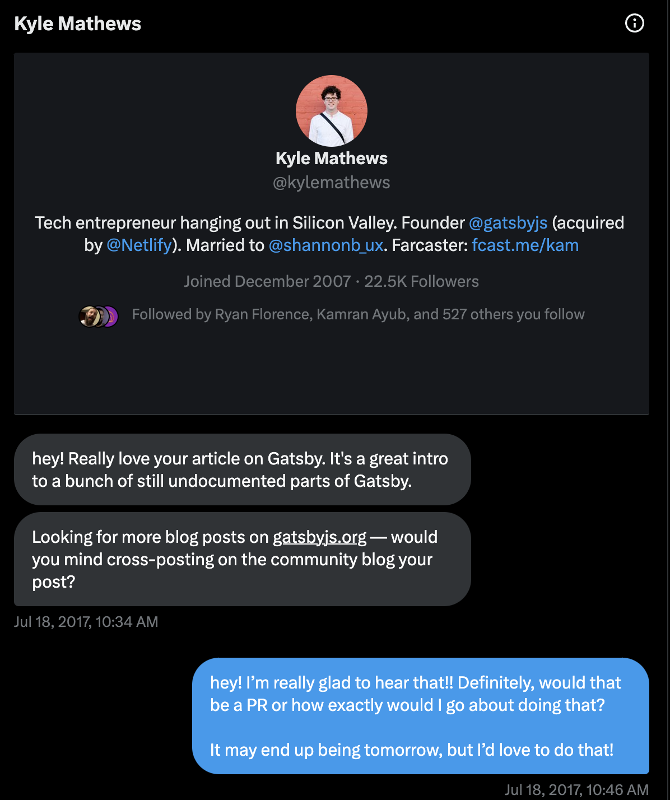

Gatsby is (was?) a React-based meta-framework that popularized many performance techniques and a modern developer experience. It helped evolve the modern development experience for making websites in many ways, specifically in the introduction of hybrid development modes, in modern performance techniques available by default, and in attempting to scale static site generation to heights previously unexplored or frankly impossible. I couldn't be more proud of the team and the work that we did, even if the destination and outcome of the Gatsby framework is not what any of us hoped for. In this post, I'll share that journey. What we did, what we learned, and what I wish we would've done differently with the benefit of hindsight. I hope it's useful to you.

## What we did

_Meta note: I try to minimize "I" language in this post and use "we" language. While I did contribute meaningful contributions to the framework early on at Gatsby, as my role evolved, the work of others (Ward Peeters, Michal P, Abhi Aiyer, Lennart Jorgens, et al) ultimately helped shape and drive the technical direction of the Gatsby framework in more ways than I ever did._

First, let's talk about the outcomes. We helped build Gatsby, which is currently being used used by [0.3% of the web](https://w3techs.com/technologies/details/cm-gatsby) (over 100K websites as of January 2024). This framework has been [starred on GitHub over 50K times](https://github.com/gatsbyjs/gatsby), making it one of the most popular open source projects of all time. While marginally out-of-scope, we also grew a SaaS business (Gatsby Cloud) which was the best place to build, preview, deploy, and host Gatsby sites from zero customers to over 1000 and over 100 enterprise customers generating nearly 5M annual recurring revenue.

We did this by delivering novel improvements to the core product and with innovations in Gatsby Cloud, or closed-source SaaS product. We did this by trying, and not always succeeding, to follow [an open-core model](https://en.wikipedia.org/wiki/Open-core_model) where features of the open-source project generally _work_ in open-source land and work best (for teams, for scale, etc.) in Gatsby Cloud.

How did we do this is more interesting than just what we did, so in an effort to tell a narrative instead of a point-by-point description of what we did, we have to go a bit back in time. Let's go back to 2017, when I first used Gatsby.

### Falling in love with a framework

There have been a few times in my career where I have gotten so focused on building something that it's the only thing I can think about. Using Gatsby for the first time is one of those times. In 2017, I was employed as a Principal Consultant and I helped large companies modernize their web stacks, typically by introducing React and "modern" backend tools like service communication and returning JSON with tools like SpringMVC. This work was interesting, but not always fulfilling so I would find myself branching out and playing with other tools to build something on nights and weekends.

I frankly don't remember how Gatsby got on my radar, but I used Gatsby for the first time to build my blog (yes, a former version of this blog you are currently reading). I loved it so much [that I wrote about my experience](https://dustinschau.com/posts/getting-started-with-gatsby/) about building a blog with Gatsby. This got noticed by Kyle Mathews, then CEO of Gatsby, and I remember being just delighted that something I wrote got recognition and attention. 

The love of the tool and the way it made me _feel_ is what I remember most, but to summarize some of the reasons I loved Gatsby at that time:

- **Performance focus**. It was so fun and it frankly felt a bit like a game to deploy my website and see 100s in all categories (performance, accessibility, etc.) in Lighthouse
- **GraphQL at build time**. This has since fallen a bit out of vogue, but I remember being so enthralled by Gatsby's usage of GraphQL and it was my foray into _learning_ GraphQL. It felt pretty amazing to be able to query my blog posts, filter them, see them all in GraphiQL, and just generally all the features that the data layer enabled me to build that were enabled by default.
- **Modern tooling**. At the time, Gatsby's tooling was bleeding edge and highly modern. SSGs of the era were Jekyll, Hugo, and so on and while these are great tools, I considered myself a JavaScript developer and so it was great to use Node.js, React, and other tools that I was more familiar with in a space where they were not _familiar_ yet.

I was hooked. I would go on to speak at local conferences (like my local one [NebraskaJS](https://nebraskajs.com)), build more and more websites with Gatsby, and then eventually would accept a position as an open-source maintainer.