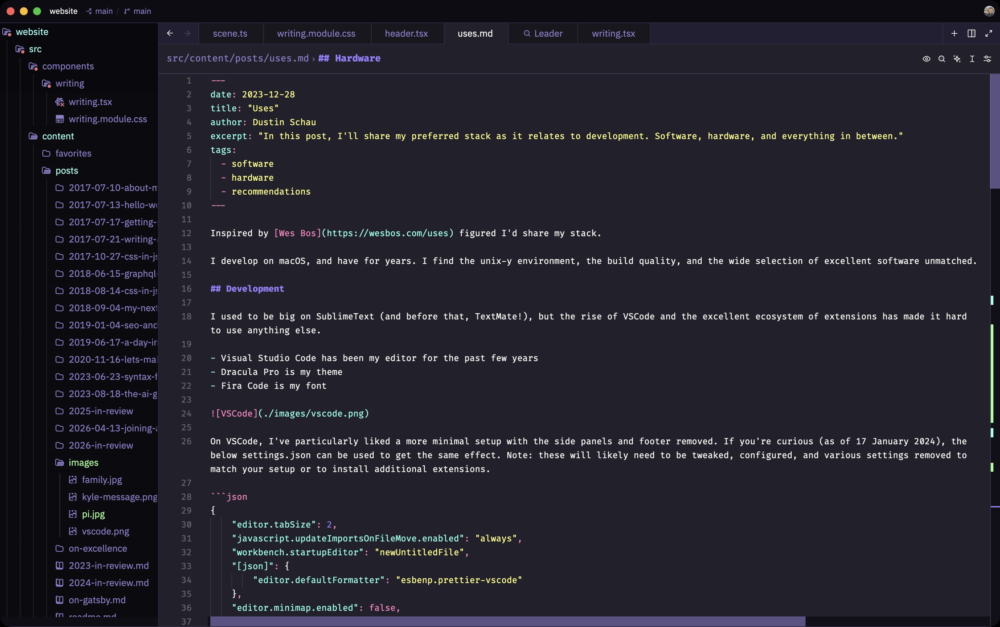
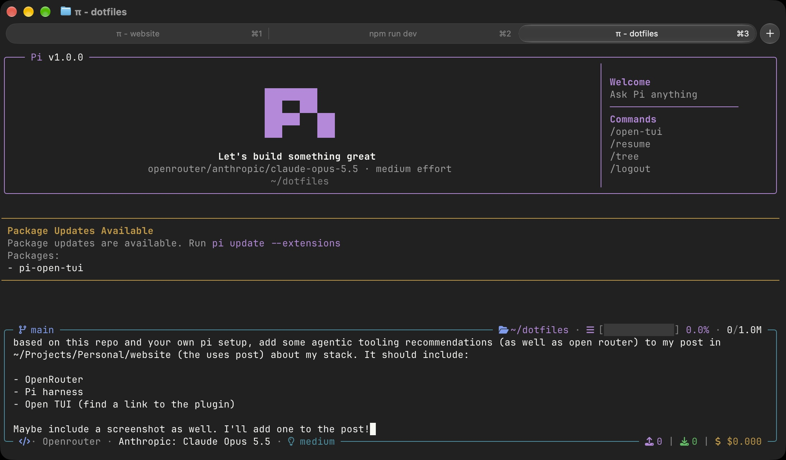

Inspired by [Wes Bos](https://wesbos.com/uses) figured I'd share my stack.

I develop on macOS, and have for years. I find the unix-y environment, the build quality, and the wide selection of excellent software unmatched.

## Development

I used to be big on SublimeText (and before that, TextMate!), then spent years in VSCode. These days I use [Zed](https://zed.dev). It's fast and native, and it feels a lot like the Sublime days, but with modern features like built-in AI edit predictions and collaboration.

- Zed is my editor
- Dracula Pro is my theme
- Fira Code is my font



I like a minimal setup, so I hide the minimap and status bar. I also keep VSCode keybindings so muscle memory carries over, and I add Sublime's "Split into Lines" back on `cmd-shift-l`. My [Zed settings](https://github.com/DSchau/dotfiles/blob/main/init/Zed/settings.json) live in my dotfiles and sync on bootstrap. Here they are:

```json
{
  "cli_default_open_behavior": "new_window",
  "base_keymap": "VSCode",
  "project_panel": {
    "dock": "left"
  },
  "status_bar": {
    "experimental.show": false
  },
  "minimap": {
    "show": "never"
  },
  "multi_cursor_modifier": "cmd_or_ctrl",
  "show_edit_predictions": true,
  "tab_size": 2,
  "ui_font_size": 16,
  "buffer_font_size": 13,
  "buffer_font_family": "Fira Code",
  "buffer_font_fallbacks": ["Menlo", "Monaco", "Courier New", "monospace"],
  "theme": {
    "mode": "system",
    "light": "Dracula Pro (Alucard)",
    "dark": "Dracula Pro"
  },
  "auto_install_extensions": {
    "astro": true,
    "html": true,
    "swift": true
  }
}
```

For a terminal, I use [Ghostty](https://ghostty.org). It's fast, native, and configured with a plain text file, which lives in my [dotfiles](https://github.com/DSchau/dotfiles/blob/main/ghostty_config). I use the Dracula+ theme and a global quake-style quick terminal on the backtick key, so a shell is always one keypress away.

As far as web browsing, I've found Arc to be great for not just daily browsing, but also for debugging since it's built on Chromium the development tools are just as good as they are in Chrome.

I spent quite a bit of time building up my [dotfiles repo](https://github.com/dschau/dotfiles) and with every new Mac I spend a little time making sure it's still easy to use and seamless.

## Agentic Tooling

More and more of my development happens alongside a coding agent in the terminal. The setup I've settled on is small and swappable, and like everything else it's checked into my [dotfiles](https://github.com/dschau/dotfiles) so a new machine is one `./bootstrap.sh` away.

- **[Pi](https://pi.dev)**. A minimal, extensible coding agent harness. It ships with a small set of tools (read, write, edit, bash) and stays out of the way. Everything else comes from extensions, skills, and packages. It's model-agnostic, so I'm not tied to any one lab's CLI, and my settings live in a single `settings.json` in my dotfiles.
- **[OpenRouter](https://openrouter.ai)**. One API key and one bill for basically every frontier model. I use it as Pi's default provider and limit the model picker to Anthropic and OpenAI models. Claude Opus is my default, and I switch models mid-session when I want a second opinion.
- **[Open TUI](https://github.com/OldSuns/pi-open-tui)** (`pi-open-tui`). A Pi package that improves the terminal UI with a more polished layout and an inline footer showing the cwd, git branch and status, context usage, tokens, and cost. It also shows telemetry like tokens/sec and time-to-first-token. You can install it with `pi install npm:pi-open-tui`.



If you're curious, this is the whole Pi config:

```json
{
  "defaultProvider": "openrouter",
  "defaultModel": "anthropic/claude-opus-5.5",
  "defaultThinkingLevel": "medium",
  "enabledModels": [
    "openrouter/anthropic/*",
    "openrouter/openai/*"
  ],
  "packages": [
    "npm:pi-open-tui"
  ],
  "quietStartup": true
}
```

## macOS Apps

My [dotfiles](https://github.com/dschau/dotfiles) repo installs these automatically. Apps come from [Homebrew casks](https://github.com/DSchau/dotfiles/blob/main/brew.sh) and the [Mac App Store](https://github.com/DSchau/dotfiles/blob/main/init/mas_apps.txt). That's the most up-to-date list.

- **Arc**. An amazing web browser that has replaced Chrome as my daily web browser. 
- **Raycast**. A useful productivity enhancement tool. I particularly like the clipboard history, the app launching, and the AI tools.
- **Bettertouchtool**. Every Mac I own gets Bettertouchtool installed day one. I use all kinds of gestures to be more productive with the laptop trackpad or the Apple Trackpad, dependent upon which I'm using.
- **Fantastical**. The best calendar app I've ever used. I use it for all my events, and I have particularly loved the natural language parsing to create events.
- **Spark Desktop**. Best mail client I've used. I use it on Mac and iOS. The snooze feature is great, as are some newer features like the block feature which introduces a gate before an e-mail gets into your inbox to block unwanted e-mail.
- **Ghostty**. My terminal (more on it above). Its global quick terminal makes a shell one keypress away.
- **1Password**. Passwords and passkeys across every device, plus the `op` CLI for the terminal.
- **Ice**. A menu bar manager that hides the clutter of icons that builds up over time.

## Hardware

Mostly pretty bog standard MacBook Pro 14", but I'll add a few of my favorite home office necessities.

- **Herman Miller Embody**. I sit in my chair roughly ~8-hours per day. The Embody is a great chair.
- **Apple Trackpad**. I love Apple's trackpad in their laptops, and the trackpad is a great accessory. I particularly like it in combination with Bettertouchtool to add custom gestures.
- **Keychron Q2 Pro**. Best mechanical keyboard I've ever used. It's heavy, the presses are satisfying, and I love some of the features like the volume knob.
- **Opal C1 Webcam**. It's not without its issues, but it's a reasonably close DSLR-like experience for much cheaper for better looking video calls.
- **Elgato Key Light**. Lighting is arguably more important than anything else for good appearance on video calls, and this is the best light I've found.
