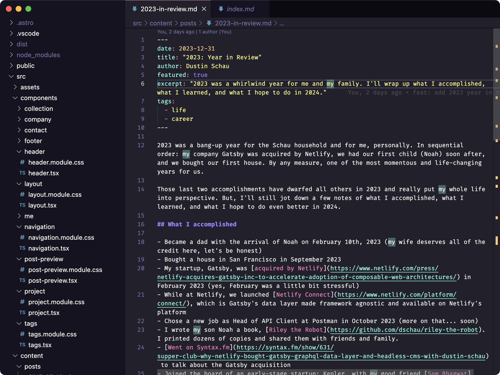

Inspired by [Wes Bos](https://wesbos.com/uses) figured I'd share my stack.

I develop on macOS, and have for years. I find the unix-y environment, the build quality, and the wide selection of excellent software unmatched.

## Development

I used to be big on SublimeText (and before that, TextMate!), but the rise of VSCode and the excellent ecosystem of extensions has made it hard to use anything else.

- Visual Studio Code has been my editor for the past few years
- Dracula Pro is my theme
- Fira Code is my font

I recently tried out a great terminal called Warp, and I've been using that daily since late 2023. I quite like it!

As far as web browsing, I've found Arc to be great for not just daily browsing, but also for debugging since it's built on Chromium the development tools are just as good as they are in Chrome.

I spent quite a bit of time building up my [dotfiles repo](https://github.com/dschau/dotfiles) and with every new Mac I spend a little time making sure it's still easy to use and seamless.

## macOS Apps

[Check out the applications](https://github.com/DSchau/dotfiles/blob/main/init/applications.txt) I install automatically with my [dotfiles](https://github.com/dschau/dotfiles) repo. That's kept most up-to-date.

- **Arc**. An amazing web browser that has replaced Chrome as my daily web browser. 
- **Raycast**. A useful productivity enhancement tool. I particularly like the clipboard history, the app launching, and the AI tools.
- **Bettertouchtool**. Every Mac I own gets Bettertouchtool installed day one. I use all kinds of gestures to be more productive with the laptop trackpad or the Apple Trackpad, dependent upon which I'm using.
- **Fantastical**. The best calendar app I've ever used. I use it for all my events, and I have particularly loved the natural language parsing to create events.
- **Spark Desktop**. Best mail client I've used. I use it on Mac and iOS. The snooze feature is great, as are some newer features like the block feature which introduces a gate before an e-mail gets into your inbox to block unwanted e-mail.

## Hardware

Mostly pretty bog standard MacBook Pro 14", but I'll add a few of my favorite home office necessities.

- **Herman Miller Embody**. I sit in my chair roughly ~8-hours per day. The Embody is a great chair.
- **Apple Trackpad**. I love Apple's trackpad in their laptops, and the trackpad is a great accessory. I particularly like it in combination with Bettertouchtool to add custom gestures.
- **Keychron Q2 Pro**. Best mechanical keyboard I've ever used. It's heavy, the presses are satisfying, and I love some of the features like the volume knob.
- **Opal C1 Webcam**. It's not without its issues, but it's a reasonably close DSLR-like experience for much cheaper for better looking video calls.
- **Elgato Key Light**. Lighting is arguably more important than anything else for good appearance on video calls, and this is the best light I've found.
